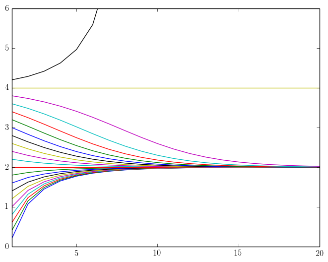

## Miscellaneous

### Racing horses

> Imagine we have 25 horses and a track with 5 lanes. What is the minimum number of races necessary to find the top three horses?
> 
> You can assume all horses perform consistently (e.g., they run at a constant speed which does not vary between races).

We claim that one can find the top three horses using 7 races as follows. 

Let's run $$5$$ races on all $$25$$ horses first and then we will have following ordering $$x_{i1}>x_{i2}>x_{i3}>x_{i4}>x_{i5}$$ for $$i=1,2,3,4,5$$. Now let's have the 6th race for top one from each race. And without loss of generality, we can assume $$x_{11}>x_{21}>x_{31}>x_{41}>x_{51}$$. Based on these $$6$$ races, we can know that top 1 is $$x_{11}$$ and $$x_{i4}, x_{i5}$$ for $$i=1,2,3,4,5$$, $$x_{j3}$$ for $$j=2,3,4,5$$, $$x_{k2}$$ for $$k=3,4,5$$ and $$x_{w1}$$ for $$w=4,5$$ have no chance to win top 3. The only 5 horses that are left are $$x_{12}, x_{13}, x_{21}, x_{22}, x_{31}$$. Run this for the 7th race and we get the answer. 

### Infinite exponentiation

> If
> $$
> x^{x^{x^\cdots}} = 2,
> $$
> what is the value of $$x$$?

As with many other problems, the simplest solution seems to involve a trick. On the other hand, the more time we spend on the problem, the more natural the solution becomes. Before we get to the actual discussion, there is an intentional ambiguity in the statement.

Let's start with a simpler expression $$x^{x^x}$$ and ask ourselves what we really mean by that. The two possibilities are $$x^{(x^x)}$$ and $$(x^x)^x$$. It is easy to see that these are not equal. To demonstrate this, take $$x = 3$$. Then
$$
3^{(3^3)} =
3^{27},
$$
while
$$
(3^3)^3 =
3^{3 \cdot 3} =
3^9.
$$
Another way to state this peculiarity is that successive exponentiation is not [associative](http://en.wikipedia.org/wiki/Associative_property).

Returning to our problem, we will interpret the give equality as
$$
x^{(x^{(x^\cdots)})} = 2.
$$
The main observation is this expression exhibits a self-similarity, namely, the power to which we raise the first $$x$$ is the same as the entire right hand side. Replacing this power with the left hand side value, we arrive at
$$
x^2 = 2,
$$
which equation has two solutions $$x = \pm \sqrt{2}$$. Raising a negative number to an irrational number is often ill-defined, so we discard the negative solution. Our final answer is
$$
x = \sqrt{2}.
$$

Let us try to understand how this problem works a little better. First, note that the left hand side is infinite, hence is not really well-defined as an algebraic expression. This sounds like a negative comment, but actually is a very constructive one.

Let us fix a positive real number $$x$$, and imagine the following sequence
$$
x, \quad
x^x, \quad
x^{x^x}, \quad
\dots.
$$
The given equality can then be interpreted as stating that this sequence converges and its limit is 2. To make this even more rigorous, consider the function $$f(u) = x^u$$. We can then define the recursive sequence $$a_n$$ given by
$$
a_1 = x, \quad
a_{n+1} = f(a_n)
$$
The equality we are trying to solve is
$$
\lim_{n \rightarrow \infty} a_n = 2.
$$
What happens if we apply $$f$$ to both sides? It turns out we can exchange $$f$$ and the limit because $$f$$ is continuous.
$$
\begin{align}
f(2)
&= f(\lim_n a_n) \\
&= \lim_n f(a_n) \\
&= \lim_n a_{n+1} \\
&= \lim_n a_n \\
&= 2
\end{align}
$$
Recalling the definition of $$f$$, this reduces to $$x^2 = 2$$ as before.

At this point, it seems that we fully understand the problem. We analyzed the meaning of the infinite expression, formally reduced it to a limit, and solved that. To push our investigation one step further, why don't we switch 2 in the statement of the problem. For example, take 4. Following out methods
$$
x^{x^{x^\cdots}} = 4
$$
reduces to $$x^4 = 4$$, which has a unique real solution $$x = \sqrt{2}$$. It seems that this coincidence is entirely harmless &ndash; we solved two different equations and found out that they share a solution. On the other hand, plugging $$x = \sqrt{2}$$ in the infinite exponentiation tower cannot produce values 2 and 4 simultaneously. Every well-defined expression can have at most one value.

To find the source of confusion, consider the sequence
$$
b_1 = c, \qquad
b_{n+1} = f(b_n),
$$
where $$f(u) = \sqrt{2}^u$$ and $$c$$ is an positive real constant. Note that the recursive relation is the same as $$a_{n+1} = f(a_n)$$ but we are using an arbitrary real constant $$c$$ to start from.

We would like to investigate the behavior of the sequence $$b_n$$ as the constant $$c$$ varies. We claim that
* if $$0 < c < 4$$, then $$\lim_n b_n = 2$$,
* if $$c = 4$$, then $$\lim_n b_n = 4$$, and
* if $$c > 4$$, then $$b_n$$ diverges to infinity.
We leave the formal proofs of these statements to the reader, and will instead present the behavior of the sequence $$b_n$$ with several starting values $$c$$. After all, a picture is worth a thousand words.

### Renaissance security

> Leodardo da Vinci would like to send a private message to his close friend Niccol\`o Macchiavelli. The messenger they use can deliver a box from one location to the other. Unfortunately, the service is not secure so anything they place in an unlocked box will be seen, copied, or worse, lost. How can they exchange the message securely?

In this problem it is very important to start with the right idea. In this case, we are referring to the fact that the package can go back and forth involving multiple shipments.

The first step is Leonardo sending a box containing the message secured by his own lock (that is, a lock only he can unlock). Then, Machiavelli just adds his lock to the box, and sends it back to Leonardo. Leonardo removes his lock from the box and sends it back to Machiavelli. Finally, Machiavelli receives the box secured only by how lock. Removing it gives him access to the secret message.

### The average offer

> A number of Harvard seniors plan to meet and celebrate their job offers. Being naturally curious, they would like to know the average salary in the group. On the other hand, no single student would like to disclose his offer to anyone else. How can they learn the group average?

