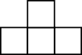

## Packing and covering

### Covering with dominoes

> We are given a $$8 \times 8$$ board with two diagonal corners missing. Is it possible to cover it completely with dominoes without any pieces overlapping.
> 
> Assume the board and domino squares are of the same size.

Proof:
Impossible.
Denote the number of black block and white block as **B** and **W** respectively. WLOG, assume the two blocks missing are black blocks. We thus have **B=30**, **W=32**, but for every domino, it has to cover one black and one white. Hence it is impossible to cover.

### Covering with length 3 pieces

> Can you tile an $$8 \times 8$$ board with $$1 \times 3$$ pieces?
> 
> What if one corner of the board is missing?

Proof:
No we can't. **8*8=64** is not divisible by **3**.

No, we still can't. Color the **8x8** board with 0,1,2 three colors in following way. For **T_{ij}**, color it with **i+j(mod 3)**. If we count the number of each color, we have number of **0**-tile is **22**, **1**-tile is **20**, **2**-tile is **21**. But each **1 x 3** will cover each color once. So it is impossible.

### Covering with T-pieces

> Can you tile a $$10 \times 10$$ board with pieces of the following shape.
> 
> 

### Packing bricks

> Is it possible to fit 53 bricks of size $$1 \times 1 \times 4$$ into a $$6 \times 6 \times 6$$ box?

Impossible.
The idea is similar to Problem 4, but with different coloring. This time instead of coloring alternatively with 1 x 1 x 1 block, we color alternatively with 2 x 2 x 2 block. WLOG, assume black is at the corner. And hence we have **B=2*2*2*(5+4+5)=112** while **W=2* 2* 2*(4+5+4)=101**. But now each bricks of 1 x 1 x 4 much cover two white and two black and hence it is impossible to fit in.

