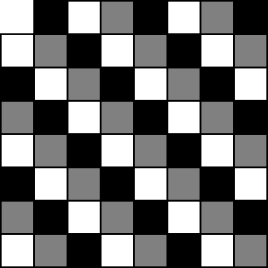

## Tiling and packing

### Tiling with dominoes

> We are given a $$8 \times 8$$ board with two diagonal corners missing. Is it possible to cover it completely with dominoes without any pieces overlapping?
> 
> Assume the board and domino squares are of the same size.

At firth sight, it is tempting to think that the answer to this question is positive. On the other hand, experimentation shows that a tiling is hard to get. As a general principle, trying to obtain a tiling (of a possibly smaller board) is a good place to start building intuition about a problem.

Let us imagine we have tried to tile the board by hand a few times unsuccessfully, and we are now convinced that no tiling exists. How can we go about proving such a result? One way would be to start adding dominoes one by one, enumerate all possible scenarios and find that none of them lead to a solution. While this may work for some smaller cases, it is clear it is not the correct strategy here.

The idea is to look for a property satisfied by any tileable board. If we show that our board does not satisfy this condition, then naturally no tiling exists. It is no coincidence that the question is stated for an $$8 \times 8$$ board, the same size as chess board. One distinguishing feature of chess boards is they are colored in black and white in an alternating pattern.

Direct inspection shows that no matter how we place a domino on the board, it always covers one white and one black square. It follows that if a board (of any shape) has a tiling by $$n$$ domino pieces, then after coloring it with the chess pattern, there must be $$n$$ white and $$n$$ black blocks.

This is just what we need. Starting from the standard board above, we need to remove two diagonally opposite corners. Without loss of generality, we can always rotate the board so these are the upper left and lower right corners. Constructing a coloring as the one shown above, both of these places are white. While the original board had an equal number of black and white pieces, each 32, the modified one has 30 white and 32 black pieces. These numbers are not equal, so we conclude that the modified board cannot be tiled with dominoes.

Note that the statement of the problem made no mention of a coloring. That was the crucial step in our solution, but at the same time, it is an auxiliary construction we have control over. Two colors worked well here, but there is no reason why we shouldn't use three or more colors in a different problem.

### Tiling with length 3 pieces

> Can you tile an $$8 \times 8$$ board with $$1 \times 3$$ pieces?
> 
> What if one corner of the board is missing?

The first question is very simple. Since $$8^2 = 64$$ is not divisible by 3, we cannot tile the entire board.

After removing a corner the number of squares is $$8^2 - 1 = 63$$ which is divisible by 3. On the other hand, experimenting with the problem quickly leads one to the suggestion no such tiling is possible. The two color argument we presented above doesn't lead to a contradiction, so we need to work harder. In this case three colors suffice.

Suppose we start with a hypothetical tiling of the board with one corner removed. By rotating, we can arrange so this corner is in the top left position. There are two ways to color the board worth investigating.

|        | Coloring A                           | Coloring B                           |
|:------:|:------------------------------------:|:------------------------------------:|
|        |||
| Whites | 22                                   | 21                                   |
| Grays  | 21                                   | 21                                   |
| Blacks | 20                                   | 21                                   |

In each of the two cases, it is easy to see that a $$1 \times 3$$ block placed anywhere on the board would contain one unit square of each color. If we choose coloring B, all colors are equally represented and no contradiction arises. On the other hand, Coloring A suffices. Indeed, no tiling is possible.

This problem is a great way to illustrate the importance of auxiliary choices we make. It is not possible to demonsrate the impossibility of tiling unless we use a correct construction. As we have seen in this case, finding the right construction is typically a trial and error process.

### Tiling with T-pieces

> Can you tile a $$10 \times 10$$ board with pieces of the following shape?
> 
> 

The shape of the pieces makes this problem appear a little harder, but in fact it is quite simple. Let us imagine a tiling exists, and we color the board in the standard alternating black and white pattern. The pieces which constitute the tiling can be split into two categories: type A which has 3 black and 1 white squares, and type B with 1 black and 3 white squares.

Suppose there are $$a$$ pieces of type A, and $$b$$ pieces of type B. The entire board has $$10^2 = 100$$ squares of which 50 are black and 50 are white. Equating the squares in each color, we obtain the following.
$$
\begin{align}
3 a + b &= 50 \\
a + 3 b &= 50 \\
\end{align}
$$
Adding and subtracting these equations, it is easy to arrive at $$a + b = 25$$ and $$a = b$$. But then $$2a = 25$$ which has no integer solutions, and we reached a contradiction. We conclude that it is impossible to tile a $$10 \times 10$$ board with T-shaped pieces.

Note that the same argument works for any board of size $$n \times n$$ where $$n$$ is odd but not divisible by 4.

### Packing bricks

> Is it possible to fit 53 bricks of size $$1 \times 1 \times 4$$ into a $$6 \times 6 \times 6$$ box?

This problem is interesting because it presents several new applications of the coloring arguments we have already seen in action. First, it demonstrates how to extend tiling questions beyond the plane. Second, the solution exhibits a curious coloring which splits the larger cube into smaller, but not unit sized, cubes.

Before presenting the argument, it is worth noting that a standard two color argument doesn't work. The size of the brick suggests that four colors may be useful, but this also leads nowhere.

As we already mentioned, it is possible to solve problem using an interesting two coloring scheme. First, subdivide the larger $$6 \times 6 \times 6$$ cube into $$3^3 = 27$$ smaller $$2 \times 2 \times 2$$ cubes. If we imagine that each of the smaller cubes is a "unit", we apply the standard alternating pattern. In this way, we obtain 14 black and 13 white $$2 \times 2 \times 2$$ cubes (or the other way around). The key point is that these numbers are not equal. Counting the unit cubes, we have $$14 \times 2^3 = 112$$ black units and $$13 \times 2^3 = 104$$ white units.

For contradiction, assume it is possible to pack all 53 bricks inside the larger cube. It is easy to see that no matter how we place a $$1 \times 1 \times 4$$ brick inside, it will always occupy 2 black and 2 white unit cubes. It follows that we need $$2 \cdot 53 = 106$$ black units and the same number of whites. On the other hand, our coloring produced only 104 whites, so they are insufficient. This demonstrates that no packing is possible.

Note that a volume computation suggests a $$6 \times 6 \times 6$$ cube should be able to fit $$6^3 / 4 = 54$$ bricks, but we cannot pack even 53! On the other hand, it is not difficult to fit 52 pieces.

