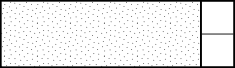
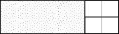

## the Fibonacci sequence

### Tiling a strip

> In how many ways can you tile an $$n \times 2$$ strip with dominoes?

Let $$T_n$$ denote the number of ways we can tile a $$n \times 2$$ strip with dominoes. If one has never seen this problem before, our first instinct should be to compute small values of $$T_n$$. Direct inspection shows that
$$
T_1 = 1, \qquad
T_2 = 2, \qquad
T_3 = 3, \qquad
T_4 = 5,
$$
which is identical to the Fibonacci sequence. This observation suggests we should be looking for a recursive relation satisfied by $$T_n$$.

Fix a value $$n \geq 3$$. We will split the tilings of a strip of length $$n$$ into two groups: those that end with a vertical domino, and those that end with two horizontal ones.

| Group 1 | Group 2 |
|---------|---------|
|  |  |

Starting with a tiling in the first group, we can remove the last domino to get a tiling of length $$n-1$$. Conversely, if we start with a tiling of length $$n-1$$, we can add a vertical domino to get one in the first group. This shows that the number of tilings in the first group is exactly $$T_{n-1}$$. Similar logic shows that there are $$T_{n-2}$$ tilings in the second group. Putting this together, we find that
$$
T_n = T_{n-1} + T_{n-2}.
$$
Together with $$T_1 = F_1 = 1$$, and $$T_2 = F_2 = 2$$, induction implies that $$T_n = F_n$$ is the $$n$$-th Fibonacci number.

### Sum of Fibonacci squares

> Find a geometric proof of the identity
> $$
> F_1^2 + \cdots + F_n^2 = F_n F_{n+1}.
> $$

### The negative Fibonacci sequence
> 
> Manipulating the recursive relation
> $$
> F_{n+2} = F_{n+1} + F_n
> $$
> to
> $$
> F_n = F_{n+2} - F_{n+1},
> $$
> allows us to define the Fibonacci numbers $$F_n$$ for negative values of $$n$$. Can you express $$F_{-n}$$ in terms of $$F_n$$?

### The Fibonacci limit

> What is the limit
> $$
> \lim_{n \rightarrow \infty} \frac{F_{n+1}}{F_n}?
> $$

Let us assume the limit exists and is equal to $$\ell$$. The trick is to find a self-similarity (similar to the *Infinite exponentiation* problem) and arrive at an equation satisfies by $$\ell$$. As with any problem involving the Fibonacci numbers, the first thing we should try to use is the recursive relation.

$$
\begin{align}
\ell
&= \lim_n \frac{F_{n+1}}{F_n} \\
&= \lim_n \frac{F_n + F_{n-1}}{F_n} \\
&= \lim_n \left( 1 + \frac{F_{n-1}}{F_n} \right) \\
&= 1 + \frac{1}{\lim_n \frac{F_n}{F_{n-1}}} \\
&= 1 + \frac{1}{\ell}
\end{align}
$$

We deduced that $$\ell$$ restiefies the equation
$$
\ell^2 - \ell - 1,
$$
whose roots are
$$
\frac{1 \pm \sqrt{5}}{2}.
$$
Since all ratios $$F_{n+1} / F_n$$ are positive, it follows that the limit $$\ell$$ is non-negative. Duscarding the negative solution, we conclude that
$$
\lim_n \frac{F_{n+1}}{F_n} =
\frac{1 + \sqrt{5}}{2}.
$$

**CHALLENGE:**
Try to show that the limit $$\ell$$ exists.

### The Fibonacci numbers and linear algebra

> Find a $$2 \times 2$$ matrix $$A$$ such that
> $$
> \begin{pmatrix}
>   F_{n+2} \\
>   F_{n+1}
> \end{pmatrix}
> =
> A
> \begin{pmatrix}
>   F_{n+1} \\
>   F_n
> \end{pmatrix}.
> $$
> Use this to find a closed formula for $$F_n$$ in terms of $$n$$.

If we write $$F_{n+2} = F_{n+1} + F_n$$, then it is immediate that
$$
\begin{pmatrix}
F_{n+2} \\
F_{n+1}
\end{pmatrix}
=
\begin{pmatrix}
F_{n+1} + F_n \\
F_{n+1}
\end{pmatrix}
=
\begin{pmatrix}
1 & 1 \\ 1 & 0
\end{pmatrix}
\cdot
\begin{pmatrix}
F_{n+1} \\
F_n
\end{pmatrix},
$$
so $$A = \left( \begin{smallmatrix} 1 & 1 \\ 1 & 0 \end{smallmatrix} \right)$$.

The characteristic polynomial of $$A$$ has roots
$$
\phi = \frac{1 + \sqrt{5}}{2}, \qquad
\psi = \frac{1 - \sqrt{5}}{2},
$$
and we can write $$A = P^{-1} \textrm{diag}(\phi, \psi) P$$, where
$$
P =
\begin{pmatrix}
\phi & 1 \\
\psi & 1
\end{pmatrix}.
$$
Note that $$\phi \cdot \psi = -1$$.

Applying the matrix equality involving $$A$$ multiple times, we obtain
$$
\begin{pmatrix}
F_{n+1} \\
F_n
\end{pmatrix}
=
A^n
\begin{pmatrix}
F_1 \\
F_0
\end{pmatrix}
=
P^{-1}
\begin{pmatrix}
\phi^n & 0 \\
0 & \psi^n
\end{pmatrix}
P
\begin{pmatrix}
1 \\ 0
\end{pmatrix}.
$$
Substituting $$P$$ leads to the [Binet formula](http://en.wikipedia.org/wiki/Fibonacci_number#Closed-form_expression):
$$
F_n =
\frac{\phi^n - \psi^n}{\phi - \psi} =
\frac{\phi^n - \psi^n}{\sqrt{5}}.
$$
We will present an alternative, although clearly related, derivation using generating functions later on.

It is worth noting that the matrix equality we derived is sometimes expressed as
$$
\begin{pmatrix}
F_{n+1} & F_n \\
F_n & F_{n-1}
\end{pmatrix}
=
\begin{pmatrix}
1 & 1 \\ 1 & 0
\end{pmatrix}^n.
$$
This equality holds for all integers $$n$$, so it gives us an alternative approach to describing the negative Fibonacci numbers.

### Other starting points

> Consider the sequence
> $$
> S_0 = a, \qquad
> S_1 = b, \qquad
> S_{n+2} = S_{n+1} + S_n,
> $$
> where $$a$$ and $$b$$ are real numbers. Can you express $$S_n$$ in terms of the Fibonacci numbers?

Note that $$F_0 = 0$$ and $$F_{-1} = F_1 = 1$$. It follows that we can write
$$
\begin{align}
S_0 &= a = a F_{-1} + b F_0, \\
S_1 &= b = a F_{0\phantom{-}} + b F_1.
\end{align}
$$
Since the $$S_n$$ satisfy the same recursive relation as the Fibonacci sequence, it follows by induction that
$$
S_n = a F_{n-1} + b F_n.
$$
This result can be interpreted as a statement that the Fibonacci sequence is somehow fundamental among all sequences which satisfy the Fibonacci recursion. Put differently, even though there is nothing special about the starting points $$F_0 = 0$$ and $$F_1 = 1$$, sequences with other starting points can always be expressed in terms of the $$F_n$$.

### A pitfalls of recursion

> Consider the following implementation of the Fibonacci sequence in Python.
>
>     def F(n):
>         if n == 0 or n == 1:
>             return n
>         else:
>             return F(n-1) + F(n-2)
>
> Let the number of functions calls resulting in a call to F(n) be $$C_n$$. Can you find a recursive definition for $$C_n$$? Does this allow us to express $$C_n$$ in closed terms? Explain why your analysis shows that the recursive implementation above is undesirable.

