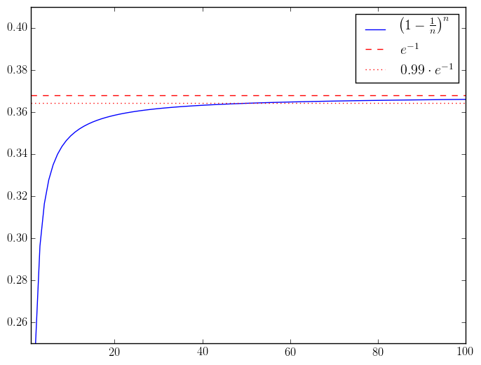

## Combinatorial probability

We all know from the simplest Venn diagram that given two sets, we can compute the size of their union as
$$
|A \cup B| =
|A| + |B| - |A \cap B|.
$$
For three sets $$A$$, $$B$$, and $$C$$, the size of their union is
$$
|A \cup B \cup C| =
|A| + |B| + |C|
- |A \cap B| - |A \cap C| - |B \cap C|
+ |A \cap B \cap C|.
$$
More generally, given $$n$$ sets $$A_1, \dots, A_n$$, we have
$$
\begin{align}
| A_1 \cup \cdots \cup A_n |
&= \sum_{I \subset \{1, \dots, n\}} (-1)^{|I| + 1} \left| \bigcap_{i \in I} A_i \right| \\
&= \sum_{k = 1}^n \left( \sum_{1 \leq i_1 < \cdots < i_k \leq n} |A_{i_1} \cap \cdots \cap A_{i_k}| \right).
\end{align}
$$
This is called the [*inclusion-exclusion principle*](http://en.wikipedia.org/wiki/Inclusion%E2%80%93exclusion_principle). It also applicable to the probability of the union of events $$A_1, \dots, A_n \subset \Omega$$ in which case
$$
\begin{align}
\mathbb{P}( A_1 \cup \cdots \cup A_n )
&= \sum_{I \subset \{1, \dots, n\}} (-1)^{|I| + 1} \; \mathbb{P}\left( \bigcap_{i \in I} A_i \right) \\
&= \sum_{k = 1}^n \left( \sum_{1 \leq i_1 < \cdots < i_k \leq n} \mathbb{P}( A_{i_1} \cap \cdots \cap A_{i_k} ) \right).  
\end{align}
$$

Given sets $$A \subset \Omega$$, let us denote its *complement* by $$\overline{A} = A^c = \Omega \setminus A$$. Given two sets $$A, B \subset \Omega$$, we can compute the union and intersection of their complements as follows.
$$
\begin{align}
  \overline{A \cap B} &= \overline{A} \cup \overline{B} \\
  \overline{A \cup B} &= \overline{A} \cap \overline{B} \\
\end{align}
$$
More generally, given $$n$$ sets $$A_1, \dots, A_n \subset \Omega$$, we have
$$
\begin{align}
  \overline{A_1 \cap \cdots \cap A_n} &= \overline{A_1} \cup \cdots \cup \overline{A_n}, \\
  \overline{A_1 \cup \cdots \cup A_n} &= \overline{A_1} \cap \cdots \cap \overline{A_n}.
\end{align}
$$
These equalities are referred to as [*De Morgan's laws*](http://en.wikipedia.org/wiki/De_Morgan%27s_laws).

### Finding a coprime

> If you choose a number between 1 and 100, what is the probability it is not coprime to 12? What about getting a number that is not coprime to 30?

The heart of this problem is the inclusion-exclusion principle. It's much better if we see this naturally, so let's start by breaking down the statement. Being not coprime to $$12 = 2^2 \cdot 3$$, means being either divisible by $$2$$ or by $$3$$. Let $$A_2, A_3 \subset \{ 1, \dots, 100 \}$$ denote the sets of numbers divisible by $$2$$ and $$3$$ respectively. We are now ready to apply the simplest form of the inclusion-exclusion principle:
$$
\mathbb{P}( \textrm{not coprime to } 12 ) =
\mathbb{P}( A_2 \cup A_3 ) =
\mathbb{P}( A_2 ) + \mathbb{P}( A_3 ) - \mathbb{P}( A_2 \cap A_3 ).
$$
The statement reduces to computing the sizes of $$A_2$$, $$A_3$$, and $$A_2 \cap A_3$$ which consists of all numbers divisible by $$6$$. It is easy to see that
$$
|A_2| = 50, \qquad
|A_3| = 33, \qquad
|A_2 \cap A_3| = 16.
$$
(More generally, there are exactly $$\lfloor k / n \rfloor$$ numbers between $$1$$ and $$n$$ divisible by $$k$$.)
We are now ready to compute
$$
\mathbb{P}( \textrm{not coprime to } 12 ) =
\frac{50}{100} + \frac{33}{100} - \frac{16}{100} =
\frac{67}{100}.
$$

To answer the second part of the question, we let $$A_5$$ be the set of numbers divisible by $$5$$ from $$1$$ to $$100$$. We can then compute
$$
\begin{align*}
\mathbb{P}( \textrm{not coprime to } 30 )
&= \mathbb{P}( A_2 \cup A_3 \cup A_5 ) \\
&= \phantom{+}\mathbb{P}( A_2 ) + \mathbb{P}( A_3 ) + \mathbb{P}( A_5 ) \\
&\phantom{=} - \mathbb{P}( A_2 \cap A_3 ) - \mathbb{P}( A_2 \cap A_5 ) - \mathbb{P}( A_3 \cap A_5 ) \\
&\phantom{=} + \mathbb{P}( A_2 \cap A_3 \cap A_5 ) \\
&= \frac{50}{100} + \frac{33}{100} + \frac{20}{100} - \frac{16}{100} - \frac{10}{100} - \frac{6}{100} + \frac{3}{100} \\
&= \frac{74}{100}.
\end{align*}
$$

### Catching the curious counterfeiter

> The minter of a kingdom produces boxes with 100 coins in each. He replaces one coin by a false one in each box. The king received intelligence about the counterfeit operation, and draws one coin from each of 100 boxes. What is the probability that the minter's side business will remain undetected? What is the answer if both 100s are replaced by $$n$$?

Let's start by studying a single box of $$100$$ coins which contains a single counterfeit. The probability of drawing the false coin is $$1/100$$, so the probability of remaining undetected is $$99/100$$. Next, if there are $$100$$ boxes in total, we need to draw a true coin from each of the boxes. Since all draws are independent, the probability is
$$
\left( \frac{99}{100} \right)^{100}.
$$
More generally when both $$100$$s are replaced by an arbitrary positive integer $$n$$, the answer is
$$
\left( \frac{n-1}{n} \right)^n =
\left( 1 - \frac{1}{n} \right)^n.
$$
This expression is reminiscent of the following limit (typically taught in pre-calculus):
$$
\lim_{n \rightarrow \infty} \left( 1 + \frac{1}{n} \right)^n = e.
$$
More generally, we have
$$
\lim_{n \rightarrow \infty} \left( 1 + \frac{x}{n} \right)^n = e^x.
$$
In the particular case we are interested $$x = -1$$, so
$$
\left( \frac{99}{100} \right)^n \approx e^{-1} \approx 0.3678.
$$
We can computationally verify that value of $$(99/100)^{100}$$ is closer to $$0.3660$$ which is only about $$0.5\%$$ from the earlier approximation.

In fact the function $$\left( 1 - 1/n \right)^n$$ approaches the limit quite fast. For example, $$n = 51$$ is the smallest value for which the approximation error is less than $$1\%$$.

This is a good place to mention that there is a simple heuristic argument which demonstrates that $$\left( 1 + \frac{x}{n} \right)^n$$ approaches $$e^x$$ as $$n \rightarrow \infty$$. Recall the Taylor expansion of $$e^x$$ around $$0$$:
$$
e^x =
\sum_{k \geq 0} \frac{x^k}{k!} =
1 + x + \frac{x^2}{2!} + \frac{x^3}{3!} + \frac{x^4}{4!} + \cdots.
$$
Let's expand $$\left( 1 + \frac{x}{n} \right)^n$$:
$$
\begin{align*}
\left( 1 + \frac{x}{n} \right)^n
&= 1 + \binom{n}{1} \frac{x}{n} + \binom{n}{2} \left( \frac{x}{n} \right)^2 + \binom{n}{3} \left( \frac{x}{n} \right)^3 + \cdots \\
&= 1 + n \cdot \frac{x}{n} + \frac{n(n-1)}{2!} \cdot \frac{x^2}{n^2} + \frac{n(n-1)(n-2)}{3!} \frac{x^3}{n^3} \\
&= 1 + x + \left( 1 - \frac{1}{n} \right) \frac{x^2}{2!} + \left( 1 - \frac{1}{n} \right) \left( 1 - \frac{2}{n} \right) \cdot \frac{x^3}{3!} + \cdots.
\end{align*}
$$
The first two terms agree with the expansion of $$e^x$$ on the nose. Since $$\lim_{n \rightarrow \infty} \frac{1}{n} = 0$$, it follows that the third term converges to $$x^2/2!$$ as $$n \rightarrow \infty$$. Similarly, the next term converges to $$x^3/3!$$, and so on. Needless to say, this is not a rigorous proof, but it can actually be strengthened to become one. More importantly, manipulating series in this fashion is a good way to build intuition and form conjectures.

### Catching the greedy counterfeiter

> Suppose the minter has expanded his operation and each box of $$n$$ he produced contains $$m$$ doctored coins. What is the probability that the king will find exactly $$r$$ false coins if he draws one from each of $$n$$ boxes?

Using analogous reasoning to the previous problem, the chance of drawing a doctored coin from a single box is $$m / n$$. Since we are drawing from $$n$$ distinct boxes independently, there are $$\binom{n}{r}$$ ways of distributing the $$r$$ false coins. Putting everything together, the probability of drawing exactly $$r$$ false coins is
$$
\binom{n}{r} \left( \frac{m}{n} \right)^r \left( 1 - \frac{m}{n} \right)^{n-r}.
$$
Note this is the $$r$$-th term in the binomial expansion of
$$
\left( \left( 1 - \frac{m}{n} \right) + \frac{m}{n} \right)^n.
$$

To extend the argument and potentially arrive at a useful approximation, let us try to study the behavior of our answer as $$n$$ becomes large. The key here is to rewrite the expression we obtained, and try to analyze it piece by piece. Some parts will be independent of $$n$$, while others won't and require a bit more effort.
$$
\begin{align*}
\binom{n}{r} \left( \frac{m}{n} \right)^r \left( 1 - \frac{m}{n} \right)^{n-r}
&= \frac{n!}{r! (n-r)!} \frac{m^r}{n^r} \left( 1 - \frac{m}{n} \right)^{n-r} \\
&= \frac{n (n-1) (n-2) \cdots (n-r+1)}{n^r} \cdot \frac{m^r}{r!} \cdot \left( 1 - \frac{m}{n} \right)^n \cdot \left( 1 - \frac{m}{n} \right)^{-r}.
\end{align*}
$$
The first part consists of $$r$$ fractions of the form $$(n - i)/n$$, all of which converge to $$1$$; the second is independent of $$n$$. As we already saw in the previous problem, the third part converges to $$e^{-m}$$, and finally the last part converges to $$1$$. In conclusion, we have shown that
$$
\mathbb{P}( \textrm{exactly $r$ false coins} ) \approx
\lim_{n \rightarrow \infty} \binom{n}{r} \left( \frac{m}{n} \right)^r \left( 1 - \frac{m}{n} \right)^{n-r} =
\frac{m^r e^{-m}}{r!}.
$$
For small $$m$$ and $$r$$, this is a computationally feasible approximation of the original answer we arrived at.

As $$r$$ varies the probabilities of $$r$$ false coins add up to $$1$$. Intuitively, the approximations we obtained should also add up to $$1$$:
$$
\begin{align*}
\sum_{r \geq 0} \frac{m^r e_{-m}}{r!}
&= e^{-m} \sum_{r \geq 0} \frac{m^r}{r!} \\
&= e^{-m} \left( 1 + m + \frac{m^2}{2!} + \frac{m^3}{3!} + \cdots \right) \\
&= e^{-m} e^m \\
&= 1.
\end{align*}
$$

### Identical birthdays

> How many people should be in the same room so that the probability of two having the same birthday is at least 1/2? How many people should be in the room so the probability of at least one of them having the same birthday as you is 1/2?

### Two decks

> We take an ordered deck of cards and form a line from its cards by taking them one by one in the order that the appear. Next, we take a well-shuffled deck and place its cards in a line directly below the first one.
> 
> (a) What is the average number of pairs of matching cards which lie directly above each other?
>
> (b) What is the answer if we do this experiment with two independently shuffled decks?
>
> (c) If each deck consists of $$n$$ cards, what is the probability that no matches occur?
>
> (d) If each deck consists of $$n$$ cards, what is the probability that there are exactly $$r$$ matches?
