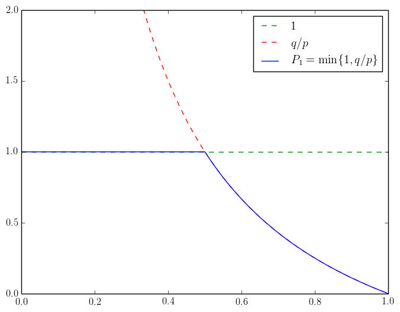

## Random walks

### Falling over a fence

> A drunk man has found his way to a fence. One step forward, and he will hit the fence and fall over. The man takes random steps towards or away from the fence. The probability of taking a step forward is 1/3, and for a step backward it is 2/3.
>
> (a) What is the probability to escape the fence and stay up?
>
> (b) What is the answer if the probability of a step backward is $$p \in [0,1]$$?
>
> (c) More generally, what is the answer if the drunk man starts $$k \geq 1$$ steps from the fence?

The goal of this problem is to find an expression for
$$
P_k = \mathbb{P}(\textrm{hitting the fence if we start at position $k$})
$$
in terms of $$p \in [0,1]$$ and $$k > 0$$. Let's start with $$P_1$$ and condition on the first step:
$$
\begin{align}
P_1
&= \mathbb{P}(\textrm{hitting the fence if we start at position 1}) \\
&= \mathbb{P}(\textrm{hitting the fence if we start at position 1} \;|\; \textrm{first step $-1$}) \cdot \mathbb{P}(\textrm{first step $-1$}) + \\
&\phantom{={}} \mathbb{P}(\textrm{hitting the fence if we start at position 1} \;|\; \textrm{first step $+1$}) \cdot \mathbb{P}(\textrm{first step $+1$}) \\
&= 1 \cdot (1 - p) + P_2 \cdot p.
\end{align}
$$
At first glance, it looks like we expressed $$P_1$$ in terms of $$P_2$$ which is even harder to compute, but that is not the end of the story.

Let's consider a path from 2 which ends up at 0. Since each step has length one, the path must pass through 1. What is the probability that a path starting at 2 ends up at 1? It doesn't take long to see that this is equal to $$P_1$$ by translation invariance. If we end up at 1, the probability of reaching 0 is again $$P_1$$. And since these two events are independent, we deduce that $$P_2 = P_1^2$$. Plugging back in the expression for $$P_1$$ above, we find that
$$
p P_1^2 - P_1 + 1 - p =
(p P_1 + p - 1) (P_1 - 1) =
0,
$$
so there are two viable solutions: $$P_1 = 1$$ and $$P_1 = q / p$$ where $$q = 1 - p$$. To figure out which one it is, it suffices to note that $$P_1$$ should be a continuous function of $$p$$. Also $$P_1 = 1$$ when $$p = 0$$ and $$P_1 = 0$$ when $$p = 1$$. The conclusion is that
$$
P_1 = \min\{ 1, q/p \}.
$$
More generally
$$
P_k =
P_1^k =
\min\left\{ 1, (q/p)^k \right\}.
$$

### Gambler's ruin

> You have $$a$$ dollars in your pocket, and your friend has $$b$$ in his. You agree to play the following game. At each step you flip a fair coin. If it comes up heads you friend gives you 1 dollar, and otherwise you give him 1. The process continues until one of you exhausts their resources, and the winner takes the lump sum of $$a + b$$ dollars. What is the probability of winning? What is the probability of winning if the coin comes up heads with probability $$p \in (0,1)$$?

### Returning home

> A drunk man leaves his house for a walk. Staying on his own street, he takes random steps back and forth with equal probability. This continues until the first time he runs back into his own house, when the stroll ends. What is the chance he will make it back?

### Returning home in higher dimensions

> What is the chance of returning home if the drunk man is traveling in the plane? The four possible steps are $$(\pm 1, \pm 1)$$, all with equal probability. Can you generalize your result to higher dimensions?
